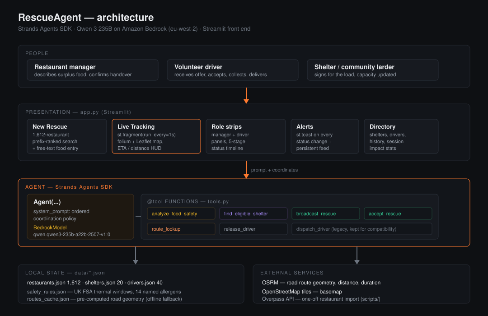

# RescueAgent — Edinburgh Food Rescue

**AWS "Agents for Humans" Hackathon — Good Neighbor Agents track**

Edinburgh throws away edible food every night while shelters a mile away run short.
The blocker is not goodwill, it is coordination: a kitchen manager at closing time has
to work out whether the food is still legally safe to give away, which shelter can take
it, and which volunteer with the right vehicle is close enough to move it inside the food
safety window. That is fifteen minutes of phone calls nobody has, so the food goes in the bin.

RescueAgent does that coordination. A manager types one sentence. The agent classifies
the food against UK FSA thermal rules, matches a shelter that is allowed to accept it and
has capacity, then broadcasts the job to the three nearest volunteers who can actually
carry it. The first to accept gets a road route, and both sides watch the same live map
until the food is signed for.

## Demo video

[Watch the demo](docs/rescueagent-demo.mp4) — **Strands Agents SDK** on **Amazon Bedrock Qwen 3 235B**.

A kitchen types one sentence. The agent classifies leftover food against UK FSA rules,
matches a shelter, and a volunteer driver takes it across Edinburgh on a live map.



> **New to the codebase?** [docs/WALKTHROUGH.md](docs/WALKTHROUGH.md) explains every part
> in detail — the Streamlit rerun model, how the Strands tools are wired, how the live map
> and driver animation work, and step-by-step deployment to Streamlit Community Cloud.

---

## Implementation

### Agent layer — Strands Agents SDK

The agent is a single `Agent` from the Strands Agents SDK backed by `BedrockModel`
running **Qwen 3 235B** (`qwen.qwen3-235b-a22b-2507-v1:0`) in `eu-west-2`. The system
prompt fixes the order of operations — classify, then match a shelter, then broadcast —
and forbids inventing driver names, shelters or distances, so every fact in the trace is
tool output rather than model recall.

Seven `@tool` functions in `tools.py` are the agent's entire surface on the world:

| Tool | What it does |
|---|---|
| `analyze_food_safety` | Parses free text for temperature class, meat/vegan/drinks, and weight (kg figures, else portion counts). Returns the applicable FSA window — 90 min hot cooked, 240 min chilled — from `safety_rules.json`. |
| `find_eligible_shelter` | Hard-filters the 20 shelters on `accepts_hot_food`, `accepts_cold_food`, `accepts_meat` and remaining capacity, then ranks survivors by demand score weighted against distance from the kitchen. |
| `broadcast_rescue` | Shortlists available drivers who pass capacity, `accepts` list, and — for hot food — `has_thermal_bag`, sorts by haversine distance, and offers the job to the nearest three. |
| `accept_rescue` | First-come-first-served. Marks the accepting driver busy and rejects any later attempt on the same job. |
| `route_lookup` | Road geometry, distance and ETA for one leg. |
| `release_driver` | Returns the driver to the roster and increments their completed count. |
| `dispatch_driver` | The original single-driver assignment, kept so the v1 flow still runs. |

Safety is enforced in the tools, not in the prompt. A driver without a thermal bag is
never offered hot food because the filter removes them before the model sees the list —
the agent cannot hallucinate its way past a food safety rule.

### Routing — `routing.py`

Live tracking needs geometry that follows streets. `get_route` calls OSRM for a full
GeoJSON polyline, caches every result to `data/routes_cache.json`, and falls back to the
cache and then to a curved estimate if the network is unavailable. `point_at(coords, t)`
interpolates a position along the polyline by distance, which is what moves the driver
marker. `scripts/precompute_routes.py` warms the cache ahead of a demo so a flaky
connection cannot break the map.

### Front end — `app.py` (Streamlit)

Eight pages: Dashboard, New Rescue, Live Tracking, Active Deliveries, Shelters, Drivers,
History, Alerts.

The delivery is a state machine — `broadcast → to_pickup → at_pickup → to_shelter →
delivered` — held in `st.session_state`. Live Tracking runs inside
`@st.fragment(run_every=1.0)`, so `advance()` ticks the clock and the map redraws once a
second without rerunning the whole script. Positions come from `point_at`, so the marker
follows real roads rather than a straight line.

The map is a Streamlit custom component (`live_map.py`) on OpenStreetMap tiles: a dashed
grey line for the driver's approach, a solid line for the delivery leg, square markers
for kitchen and shelter, and a pulsing marker on arrival. The browser animates the
driver along the OSRM polyline at 60 fps so Streamlit reruns do not make the map blink.
Before anything is dispatched, all 40 drivers are plotted at their current positions;
once a driver accepts, the rest dim and the assigned driver is tracked.

Both roles sit under the shared map. The manager strip carries the five-stage timeline
and the handover confirmation; the driver strip shows the open offers with Accept
buttons, then the assigned job card. `st.toast` fires on every transition, including the
one that matters most on stage — *"Rahul has arrived at Dishoom — hand over the food."*

Demo timings are slowed enough to follow on a projector while still fitting a
three-minute pitch: each road leg plays for 20–30 s, with auto-accept and auto-handover
fallbacks if nobody taps. Constants at the top of `app.py`.

### Data

| File | Records | Source |
|---|---|---|
| `data/restaurants.json` | 1,612 | Real Edinburgh restaurants, OpenStreetMap via Overpass API |
| `data/shelters.json` | 20 | Real Edinburgh shelters, foodbanks and community larders, hand-curated |
| `data/drivers.json` | 40 | Generated volunteer roster, 6 vehicle classes, capacity and thermal kit |
| `data/safety_rules.json` | — | UK FSA thermal windows, danger zone, 14 named allergens |
| `data/routes_cache.json` | — | Cached OSRM geometry, written on first use |

---

## Setup

Python 3.10+ and an AWS account with Bedrock access in `eu-west-2`.

```bash
python -m venv .venv
source .venv/bin/activate          # Windows: .venv\Scripts\activate
pip install -r requirements.txt
aws configure                      # access key, secret, region eu-west-2
```

Enable the model in the Bedrock console: region `eu-west-2`, model
**Qwen 3 235B** (`qwen.qwen3-235b-a22b-2507-v1:0`).

The app still runs without Bedrock: turn **AI reasoning** off in the sidebar and the
same tools run locally. Optional before a live demo:

```bash
python scripts/precompute_routes.py --light
```

## Run

```bash
streamlit run app.py
```

Opens at `http://localhost:8501`.

The sidebar **AI reasoning** toggle calls **Amazon Bedrock Qwen 3 235B** through the
Strands Agents SDK. Off, the deterministic tool pipeline runs alone — same trace, same
map, no network call. Useful when venue wifi is unreliable.

## Demo path (about 3 minutes)

1. **New Rescue** — search a kitchen (type `awa` for Awaafi on Gorgie Road), or use a preset chip.
2. Describe the food, e.g. *"6 kg hot chicken curry and rice, cooked 40 minutes ago"*.
3. **Send to agent** — watch the trace: classification, shelter match, three-driver broadcast.
4. Tap **Accept** on a driver, or wait for the nearest to auto-accept.
5. The marker moves along the road route, ETA and distance counting down.
6. Arrival toast fires. Confirm handover. Delivery completes and the dashboard totals move.

## Project layout

```
rescueagent/
├── app.py                        # Streamlit UI + delivery state machine
├── tools.py                      # 7 @tool functions for the Strands agent
├── live_map.py                   # 60 fps tracking map (custom Streamlit component)
├── routing.py                    # OSRM routing, cache, geo interpolation
├── test_agent.py
├── requirements.txt
├── LICENSE                       # MIT
├── .streamlit/config.toml        # dark theme
├── docs/
│   ├── architecture.svg
│   └── WALKTHROUGH.md            # detailed code-to-deployment guide
├── data/                         # restaurants, shelters, drivers, FSA rules, seed
└── scripts/
    ├── precompute_routes.py      # warm the OSRM cache before a demo
    ├── fetch_osm_restaurants.py
    ├── generate_drivers.py
    └── generate_history.py
```

## Known limits

- Driver movement is simulated along the OSRM polyline. There is no GPS feed;
  wiring one in would replace the interpolated position and nothing else.
- The map animates in the browser at 60 fps; Streamlit state still ticks about once a second.
- One delivery in flight at a time.
- The public OSRM demo server is rate-limited — run `precompute_routes.py` first.

## AI tools used (hackathon disclosure)

Written during the Submission Period with Cursor for boilerplate, UI, debugging and
docs. No pre-existing AI-built project was reused. Restaurant coordinates come from
OpenStreetMap; Edinburgh shelters were hand-curated; volunteer drivers are generated
seed data. The agent, tools, safety rules and live map are original to this repo.

## License

MIT — see [LICENSE](LICENSE). GitHub should show **MIT** in the repository About panel
because `LICENSE` sits at the repo root.
